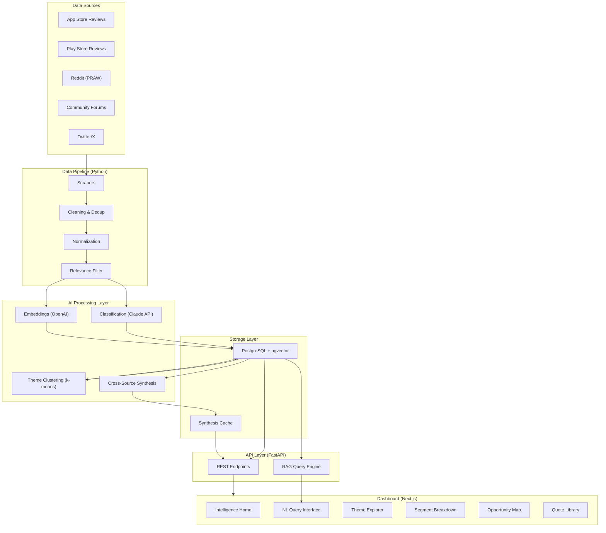

# AI-Powered Review Discovery Engine — Implementation Plan

> Building a production-grade intelligence platform that converts unstructured Spotify user feedback from 5 public sources into structured, queryable product intelligence via an interactive PM dashboard.

---

## Problem Summary

Spotify users with intent to discover new music still default to familiar content. Behavioral data tells **what** users do, but not **why**. Millions of qualitative signals (App Store reviews, Reddit threads, forum posts, tweets) explain the *why* — but they're unstructured, distributed, and manually unanalyzable at scale. This system bridges that gap.

---

## User Review Required

> [!IMPORTANT]
> **Tech stack confirmation** — The spec calls for **Next.js 14 + Tailwind CSS** for the frontend and **FastAPI (Python)** for the backend. Please confirm:
> 1. Are you okay with **Tailwind CSS v3** (stable) or do you prefer **v4**?
> 2. For the database, shall we use **Supabase** (managed PostgreSQL + Auth + pgvector) to reduce ops burden, or self-hosted PostgreSQL on Railway/Render?
> 3. For AI processing: **Claude API (claude-sonnet-4-6)** as primary — do you have API keys for Anthropic and OpenAI (for embeddings)?
> 4. For deployment: **Vercel** (frontend) + **Railway** (backend) — acceptable?

> [!WARNING]
> **Twitter/X API access** — The spec lists Twitter as Source 5 but notes it may be cost-prohibitive. Should we plan with the **Apify fallback** from the start, or attempt the official API first?

> [!IMPORTANT]
> **Synthetic / seed data** — For Phase 2 scrapers, real scraping requires live API keys and may hit rate limits during development. I recommend building scrapers against **real APIs** but also creating a **seed data generator** (realistic mock data) so the full pipeline can be developed and demoed even if some sources are temporarily blocked.

---

## Open Questions

1. **Auth provider**: Clerk vs Supabase Auth? If we use Supabase for the DB, Supabase Auth is simpler. Otherwise, Clerk gives more customization.
2. **Hosting budget**: Railway free tier has limits. Do you have paid tiers available?
3. **Demo credentials**: Should the demo account be a simple email/password or a magic link?
4. **Fellowship timeline**: What is the target demo date? This affects how aggressively we parallelize phases.

---

## Architecture Overview



---

## Proposed Changes — Phase-by-Phase

---

### Phase 1: Project Scaffolding & Infrastructure (Days 1–2)

Set up the monorepo structure, database, and development environment.

#### [NEW] Project Root Structure

```
c:\spotify\
├── backend/               # FastAPI Python backend
│   ├── app/
│   │   ├── main.py        # FastAPI app entry
│   │   ├── config.py      # Settings (env vars, API keys)
│   │   ├── database.py    # SQLAlchemy + pgvector setup
│   │   ├── models/        # SQLAlchemy ORM models
│   │   ├── scrapers/      # Source-specific scrapers
│   │   ├── pipeline/      # Cleaning, dedup, normalization
│   │   ├── ai/            # Classification, embedding, clustering
│   │   ├── api/           # FastAPI route modules
│   │   └── services/      # Business logic layer
│   ├── requirements.txt
│   ├── alembic/           # DB migrations
│   └── alembic.ini
├── frontend/              # Next.js 14 dashboard
│   ├── src/
│   │   ├── app/           # App Router pages
│   │   ├── components/    # Reusable UI components
│   │   ├── lib/           # API client, utils
│   │   └── styles/        # Global CSS + Tailwind config
│   ├── package.json
│   └── next.config.js
├── scripts/               # Utility scripts (seed data, one-off jobs)
├── docker-compose.yml     # Local PostgreSQL + pgvector
├── .env.example
└── problem_statement.md
```

#### [NEW] `backend/app/config.py`
- Pydantic `Settings` class reading from `.env`
- Keys: `DATABASE_URL`, `ANTHROPIC_API_KEY`, `OPENAI_API_KEY`, `REDDIT_CLIENT_ID`, `REDDIT_CLIENT_SECRET`, `TWITTER_BEARER_TOKEN`

#### [NEW] `backend/app/database.py`
- SQLAlchemy async engine with `asyncpg`
- pgvector extension initialization
- Session factory

#### [NEW] `backend/app/models/` (all ORM models)
- `raw_review.py` — `RawReview` model (maps to `raw_reviews` table)
- `classified_review.py` — `ClassifiedReview` model (maps to `classified_reviews` table)
- `theme.py` — `Theme` model + `ReviewThemeMapping`
- `synthesis_cache.py` — `SynthesisCache` model
- `query_log.py` — `QueryLog` model
- `collection.py` — `QuoteCollection` + `CollectionItem` models

#### [NEW] `docker-compose.yml`
- PostgreSQL 16 with pgvector extension
- Exposed on port 5432 for local dev

#### [NEW] `alembic/` migrations
- Initial migration creating all 6+ tables per the schema in spec §5.1

---

### Phase 2: Data Ingestion Layer — Scrapers (Days 3–6)

Build all 5 source scrapers + the cleaning/normalization pipeline.

#### [NEW] `backend/app/scrapers/base_scraper.py`
- Abstract base class: `async def scrape() → list[RawReview]`
- Common retry logic, rate-limit handling, exponential backoff
- Logging and metrics per run

#### [NEW] `backend/app/scrapers/app_store.py`
- Uses `app-store-scraper` package (App ID: `324684580`)
- Fetches 1,000+ reviews, prioritizing 1–3 star and last 12 months
- Maps fields to `RawReview` schema

#### [NEW] `backend/app/scrapers/play_store.py`
- Uses `google-play-scraper` package (package: `com.spotify.music`)
- Sorted by relevance + recency
- 1,000+ reviews target

#### [NEW] `backend/app/scrapers/reddit.py`
- Uses PRAW with the 10 specified search queries across 5 subreddits
- Captures posts + top 10 comments per post (score > 5)
- 500+ posts target

#### [NEW] `backend/app/scrapers/community_forum.py`
- Playwright-based scraper for `community.spotify.com`
- Targets Music Recommendations, Discover Weekly, Suggestions boards
- Captures threads + replies, kudos, status
- 200+ threads target

#### [NEW] `backend/app/scrapers/twitter.py`
- Twitter/X API v2 (Basic tier) with Apify fallback
- 7 specified search queries
- 500+ posts, English only, no retweets
- Graceful degradation if API unavailable

#### [NEW] `backend/app/pipeline/cleaner.py`
- **Deduplication**: SHA-256 hash of body text; Jaccard similarity > 0.85 for near-dupes
- **Language filter**: `langdetect` — keep English, store non-English separately
- **Relevance filter**: Keyword list match (17 keywords from spec §3.6)
- **Text normalization**: Strip HTML, special chars, truncate > 2000 chars, anonymize PII
- **Metadata enrichment**: `source_weight`, `recency_score`, `processed_at`

#### [NEW] `backend/app/pipeline/orchestrator.py`
- Coordinates: scrape → clean → store
- Tracks ingestion run stats in `pipeline_runs` table
- Supports single-source or all-source triggers

#### [NEW] `scripts/seed_data.py`
- Generates 500+ realistic synthetic reviews across all 5 sources
- Covers all complaint categories, segments, sentiments
- Used for development when real APIs are unavailable

---

### Phase 3: AI Processing Layer (Days 7–10)

Classification, embedding, clustering, and synthesis.

#### [NEW] `backend/app/ai/classifier.py`
- Takes cleaned reviews, sends to Claude API (claude-sonnet-4-6) in batches of 50
- Uses the exact classification prompt from spec §4.1
- Temperature 0.1, max tokens 500
- JSON parse with retry (1 retry on parse failure → `classification_failed` flag)
- GPT-4o fallback if Claude API errors
- Returns: `ClassifiedReview` objects

#### [NEW] `backend/app/ai/embedder.py`
- Uses OpenAI `text-embedding-3-small` (1536 dimensions)
- Embeds full `body` text for semantic search
- Embeds `key_frustration_phrase` for clustering
- Batch processing with rate-limit handling
- Stores vectors in pgvector column

#### [NEW] `backend/app/ai/clusterer.py`
- k-means clustering on `key_frustration_phrase` embeddings
- Initial k=8, adjusted by silhouette score
- For each cluster: send top 20 representatives to AI for theme labeling
- Outputs: `Theme` objects with `theme_name`, `theme_description`, `representative_quote`
- Creates `review_theme_mapping` entries with similarity scores

#### [NEW] `backend/app/ai/synthesizer.py`
- Daily batch aggregations:
  - Theme frequency by source
  - Theme frequency by segment
  - Cross-source confidence scoring (3+ sources → `high_confidence`)
  - Trend direction (growing/stable/declining)
  - Top 5 unmet needs by frequency
  - Top representative quotes per theme (weighted by `source_weight × recency_score × |sentiment_score|`)
- Stores all results in `synthesis_cache` table with expiry

#### [NEW] `backend/app/ai/query_engine.py` (RAG)
- Embeds incoming PM query
- Cosine similarity search over `classified_reviews` embeddings (top-k=20)
- NLP intent extraction: detect source filters, segment filters, theme mentions
- Hybrid retrieval: vector similarity + structured SQL filters
- Sends retrieved results + query to AI for synthesis (prompt from spec §6.3)
- Returns: structured answer + raw results + confidence + follow-up suggestions

---

### Phase 4: API Layer (Days 11–13)

FastAPI REST endpoints powering the dashboard.

#### [NEW] `backend/app/api/ingest.py`
- `POST /api/ingest/trigger` — trigger ingestion (all or specific source)
- Returns job status, entry counts

#### [NEW] `backend/app/api/reviews.py`
- `GET /api/reviews` — paginated list with filters (source, segment, theme, date range, sentiment, rating)
- `GET /api/reviews/{id}` — single review with full classification data

#### [NEW] `backend/app/api/query.py`
- `POST /api/query` — natural language query endpoint
- Input: `{ "query": "string" }`
- Output: `{ "synthesis": {...}, "raw_results": [...], "confidence": "string", "follow_ups": [...] }`
- Logs query to `query_log` table

#### [NEW] `backend/app/api/themes.py`
- `GET /api/themes` — all themes with stats
- `GET /api/themes/{id}` — deep-dive: reviews by source, by segment, sentiment breakdown, trend, quotes, related themes

#### [NEW] `backend/app/api/segments.py`
- `GET /api/segments` — all segment summaries
- `GET /api/segments/{id}` — full breakdown: top complaints, unmet needs, sentiment, JTBD statements, cross-source presence, quotes

#### [NEW] `backend/app/api/opportunities.py`
- `GET /api/opportunities` — opportunity map data: themes × frequency × severity × cross-source score × dominant segment

#### [NEW] `backend/app/api/synthesis.py`
- `GET /api/synthesis/summary` — pre-aggregated home dashboard data from `synthesis_cache`

#### [NEW] `backend/app/api/quotes.py`
- `GET /api/quotes` — filtered quotes for Quote Library
- `POST /api/collections` — create named collection
- `PUT /api/collections/{id}` — add/remove quotes
- `GET /api/collections` — list PM's collections

#### [NEW] `backend/app/api/health.py`
- `GET /api/health` — pipeline status, DB connection, API key validation, last ingestion timestamp

#### Cross-cutting concerns:
- CORS middleware (allow frontend origin)
- Rate limiting: 100 req/min per authenticated user
- Request validation with Pydantic schemas
- Error handling middleware with structured error responses

---

### Phase 5: Dashboard Frontend (Days 14–21)

Next.js 14 (App Router) + Tailwind CSS — 6 views.

#### [NEW] `frontend/` — Next.js 14 project
- Initialize with `npx -y create-next-app@latest ./` (App Router, TypeScript, Tailwind)
- Install: `axios`, `recharts` (charts), `lucide-react` (icons), `@clerk/nextjs` or Supabase Auth client

#### [NEW] `frontend/src/lib/api.ts`
- Typed API client wrapping all backend endpoints
- Axios instance with auth headers, base URL config, error interceptors

#### [NEW] `frontend/src/app/layout.tsx`
- Root layout: sidebar navigation, auth wrapper, dark mode support
- Sidebar: links to all 6 views + health indicator (green/yellow/red)

---

#### View 1: Intelligence Home (`/`)

##### [NEW] `frontend/src/app/page.tsx` + components

| Component | Description |
|---|---|
| `StatsBar` | Total reviews, active sources, last updated, date range picker |
| `TopThemesPanel` | Top 6 themes — name, count, %, cross-source badges, trend indicator (↑→↓). Click → expand with quotes + segment breakdown |
| `UnmetNeedsPanel` | Top 5 unmet needs as ranked cards |
| `SegmentChart` | Donut/bar chart — % reviews per user segment |
| `SentimentOverview` | Stacked bar by source showing sentiment distribution |

---

#### View 2: NL Query Interface (`/query`)

##### [NEW] `frontend/src/app/query/page.tsx` + components

| Component | Description |
|---|---|
| `QueryInput` | Chat-style input with send button, example query chips |
| `SynthesisCard` | AI answer: direct answer, evidence bullets, confidence badge, follow-up suggestions |
| `RawResultsList` | Expandable list of retrieved reviews with metadata badges |
| `QueryHistory` | Sidebar showing recent queries from `query_log` |

---

#### View 3: Theme Explorer (`/themes`)

##### [NEW] `frontend/src/app/themes/page.tsx` + components

| Component | Description |
|---|---|
| `ThemeSelector` | Dropdown of all themes |
| `ThemeHeader` | Name, description, review count |
| `SourceBreakdownChart` | Bar chart: reviews per source |
| `SegmentBreakdownChart` | Bar chart: reviews per segment |
| `SentimentPieChart` | Pie chart: sentiment distribution |
| `TrendLineChart` | Line chart: monthly review count |
| `QuoteCards` | Top 10 representative quotes with source/date/rating badges |
| `RelatedThemes` | Cards for embedding-similar themes |
| `ReviewsTable` | Filterable, sortable raw reviews table |

---

#### View 4: Segment Breakdown (`/segments`)

##### [NEW] `frontend/src/app/segments/page.tsx` + components

| Component | Description |
|---|---|
| `SegmentSelector` | All 7 segments |
| `SegmentStats` | Total reviews, top 3 complaints, top unmet needs |
| `SentimentDistribution` | Chart for selected segment |
| `JTBDStatements` | Top 5 JTBD cards |
| `CrossSourcePresence` | Heatmap/bar showing which platforms this segment appears on |
| `RepresentativeQuotes` | Top 10 quotes |

---

#### View 5: Opportunity Map (`/opportunities`)

##### [NEW] `frontend/src/app/opportunities/page.tsx` + components

| Component | Description |
|---|---|
| `BubbleChart` | 2×2 matrix — X: frequency, Y: severity, size: cross-source score, color: segment. Hover: theme name, count, top quote. Click → Theme Explorer |
| `OpportunityLegend` | Color legend for segments + size legend |
| `PriorityList` | Ranked list view of same data as an alternative to the visual |

---

#### View 6: Quote Library (`/quotes`)

##### [NEW] `frontend/src/app/quotes/page.tsx` + components

| Component | Description |
|---|---|
| `FilterPanel` | Source, segment, theme, sentiment, date range, rating filters |
| `QuotesList` | Paginated quotes with full body (expandable), badges (source, date, rating, segment, theme) |
| `CopyButton` | Copies formatted quote with attribution |
| `SaveToCollection` | Bookmark quote to named collection |
| `CollectionsPanel` | Sidebar to manage saved collections |

---

### Phase 6: Pipeline Scheduling & Monitoring (Days 22–23)

Automated jobs and health monitoring.

#### [NEW] `backend/app/scheduler.py`
- APScheduler or custom cron config for:
  - `ingest_all_sources` — Weekly (Sunday 2am UTC)
  - `classify_new_reviews` — Daily (1am UTC)
  - `update_clusters` — Weekly (Monday 4am UTC)
  - `refresh_synthesis_cache` — Daily (3am UTC)
  - `embed_new_reviews` — Daily (2am UTC)
  - `health_check` — Every 15 minutes

#### [NEW] `backend/app/models/pipeline_run.py`
- `PipelineRun` model: job name, start/end time, entries processed, errors, status

#### [NEW] `backend/app/services/monitoring.py`
- Alert triggers: zero ingestion, >5% classification failure, >3s dashboard response, auth errors
- Slack webhook or email notification
- Health status endpoint data provider

---

### Phase 7: Deployment, Auth & Polish (Days 24–28)

Production deployment, authentication, and acceptance criteria validation.

#### Deployment

| Component | Platform | Config |
|---|---|---|
| Frontend | Vercel | Connect GitHub repo, auto-deploy `frontend/` |
| Backend | Railway or Render | Docker container from `backend/`, env vars, persistent PostgreSQL |
| Database | Supabase or Railway PostgreSQL | pgvector extension enabled |
| Cron jobs | Railway cron or GitHub Actions | Schedule per §8.1 |

#### Authentication
- Integrate Clerk or Supabase Auth
- Demo account with pre-set credentials
- Protected routes on both frontend and API

#### Polish & Validation
- Meet all 10 acceptance criteria from spec §12
- Load testing: dashboard < 3s, query < 10s
- Minimum 500 classified entries in DB
- ≥ 3 sources actively ingesting
- ≥ 5 themes with ≥ 20 reviews each
- ≥ 3 distinguishable user segments
- Manual spot-check: ≥ 85% classification accuracy
- Public URL accessible, demo credentials working

---

## Verification Plan

### Automated Tests

```bash
# Backend unit tests
cd backend && pytest tests/ -v

# API integration tests
cd backend && pytest tests/api/ -v

# Frontend build verification
cd frontend && npm run build

# Lint checks
cd backend && ruff check .
cd frontend && npm run lint
```

### Manual Verification

| Check | Method |
|---|---|
| Data volume ≥ 500 classified entries | Query `SELECT COUNT(*) FROM classified_reviews WHERE is_discovery_relevant = true` |
| Source coverage ≥ 3 sources | Query `SELECT DISTINCT source FROM raw_reviews` |
| Classification accuracy ≥ 85% | Manually review 50 random classified entries |
| ≥ 5 coherent themes | Review themes table, verify non-overlapping |
| Query response < 10s | Time 5 representative NL queries |
| Dashboard load < 3s | Browser DevTools network timing |
| Cross-source signal | Query themes with `cross_source_count >= 3` |
| Segment signal | Query `SELECT DISTINCT user_segment_signal FROM classified_reviews` |
| Demo URL accessible | Open in incognito browser, log in with demo creds |

---

## Timeline Summary

| Phase | Days | Focus |
|---|---|---|
| **Phase 1** | 1–2 | Project scaffolding, DB schema, Docker setup |
| **Phase 2** | 3–6 | 5 scrapers + cleaning pipeline + seed data |
| **Phase 3** | 7–10 | AI classification, embeddings, clustering, synthesis, RAG |
| **Phase 4** | 11–13 | FastAPI REST endpoints (all 12+ routes) |
| **Phase 5** | 14–21 | Next.js dashboard (6 views, charts, query UI) |
| **Phase 6** | 22–23 | Cron scheduling, monitoring, alerts |
| **Phase 7** | 24–28 | Deployment, auth, polish, acceptance validation |

> [!TIP]
> **Phases 2 and 5 are the heaviest.** Phase 2 can be parallelized (each scraper is independent). Phase 5 benefits from having the API layer (Phase 4) complete first, but static UI scaffolding can begin earlier using the seed data.
